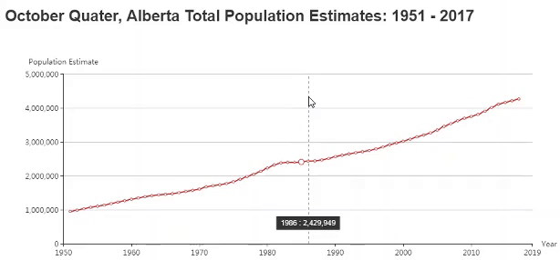

<strong>Metadata</strong> 
Data Source: Statistics Canada 
Date Updated: September 27, 2018 
Notes: Estimates from July 1, 1971 on include non-permanent residents and are adjusted for net census undercoverage, including incompletely enumerated Indian Reserves. Estimates prior to this date are unadjusted for net census undercoverage and do not include non-permanent residents. 
All estimates subject to revision.

## Credits
- <a href="https://www.sciencedirect.com/science/article/pii/S2468502X18300068" target="_blank">Echarts Research Paper</a>
- <a href="https://ecomfe.github.io/echarts-doc/public/en/tutorial.html#Get%20Started%20with%20ECharts%20in%205%20minutes" target="_blank">Echarts Tutorial</a>
- <a href="https://ecomfe.github.io/echarts-doc/public/en/api.html#echarts" target="_blank">Echarts API</a>
- <a href="https://ecomfe.github.io/echarts-doc/public/en/option.html#title" target="_blank">Echarts Option</a>
- <a href="https://ecomfe.github.io/echarts-examples/public/editor.html?c=line-smooth" target="_blank">Smooth Line Chart</a>
- <a href="https://ecomfe.github.io/echarts-examples/public/editor.html?c=multiple-x-axis" target="_blank">Multiple X Axes</a>
- <a href="https://open.alberta.ca/opendata/alberta-population-estimates-data-tables" target="_blank"> Quarterly Alberta total population estimates: 1951 - current (September 27, 2018) - Open Data</a>
